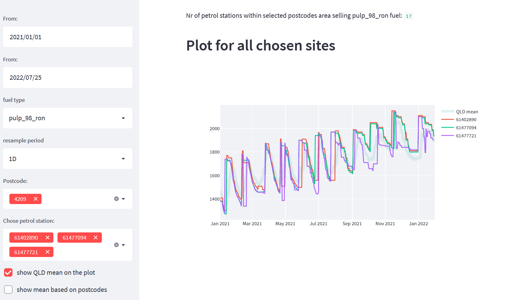

# fuel_forecast_explorer
This project was created to explore fuel prices data scraped with [my other project](https://github.com/gsajko/QLD_fuel_scraping).

In future, I'm planning on adding forecasting of future prices.

## Streamlit app

Click [this link](https://gsajko-fuel-forecast-explorer-streamlitst-app-jdeu5y.streamlitapp.com/) for the streamlit app.

## setup
if by running `poetry install` you get error:

  `ModuleNotFoundError: No module named 'distutils.cmd'`

run 

`sudo apt-get install python3-distutils`
